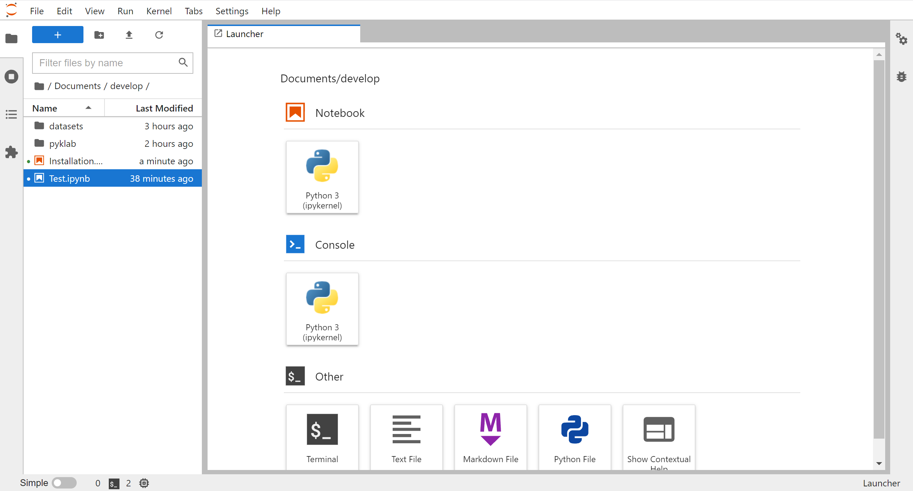

# pyklab
This repository is a library for Materials Informatics published by Assistant Professor <a href="https://researchmap.jp/mkumagai?lang=en">Masaya Kumagai</a> at Kyoto University.

## ENVIRONMENT SETUP
### <b>○ GUI (Anaconda Navigator)</b>
#### 1. Download the source code from the "Download ZIP" button under "Code" in this repository.


<br><br>

#### 2. Unzip the downloaded zip file and copy or move the extracted directory to your working space. Please modify the name of the directory from "pyklab-main" to "pyklab".

#### 3. After [starting jupyterlab](docs/jupyterlab_setup.md), create new notebook for the installation and run the following command.
```
conda install -y -c conda-forge pymatgen beautifulesoup4 ipywidgets
```


※You can also use the Anaconda prompt to do the installation, but here we show you how to do it without seeing the black command screen.

※For detailed usage of jupyterlab, please see other sites.
<br><br>

### <b>○ CLI</b>
#### 1. Download the package from <a href="https://www.anaconda.com/products/individual">Anaconda's official website</a> and install it. Please make sure that the conda command is available.

#### 2. By executing the following commands, you can download the pyklab library on an arbitrary workspace, and complete the creation of the execution environment.

```sh
cd YOUR_WORKSPACE
git clone https://github.com/kumagallium/pyklab.git
conda create -n pyklab_dev --file pyklab/conda_env.txt
jupyter lab
```


## How to use
On jupyterlab, you can start using this library by importing pyklab.

```python
from pyklab import pyklab
```


## Contributing
1. Fork it (`git clone https://github.com/kumagallium/pyklab.git`)
2. Create your feature branch (`git checkout -b your-new-feature`)
3. Commit your changes (`git commit -am 'feat: add some feature'`)
4. Push to the branch (`git push origin your-new-feature`)
5. Create a new Pull Request

## License
Labmine is developed and maintained by Masaya Kumagai, under [BSD 2-Clause "Simplified" License](LICENSE.txt).