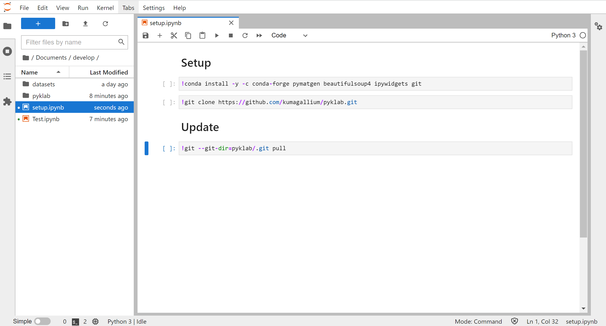

# pyklab
This repository is a library for Materials Informatics published by Assistant Professor <a href="https://researchmap.jp/mkumagai?lang=en">Masaya Kumagai</a> at Kyoto University.

## ENVIRONMENT SETUP
Set up an environment with a directory tree structure like the following.
```
|-YOUR_WORKSPACE
  |- pyklab(<-get it from Github)
  |- ~~.ipynb
```

### <b>○ GUI</b>
#### 1. After [starting jupyterlab](docs/jupyterlab_setup.md), create new notebook (e.g. setup.ipynb) for setup and run the following commands on the notebook.
```
!conda install -y -c conda-forge pymatgen beautifulesoup4 ipywidgets git
```
```
!git clone https://github.com/kumagallium/pyklab.git
```


<br><br>

#### 2. If you want to update the library to the latest version, please run the following command on your workspace.
```
!git --git-dir=pyklab/.git pull
```

※You can also use the Anaconda prompt to do the installation, but here we show you how to do it without seeing the black command screen.

※For detailed usage of jupyterlab, please see other sites.
<br><br>

### <b>○ CLI</b>
#### 1. Download the package from <a href="https://www.anaconda.com/products/individual">Anaconda's official website</a> and install it. Please make sure that the conda command is available.

#### 2. By executing the following commands, you can download the pyklab library on an arbitrary workspace, and complete the creation of the execution environment.

```sh
cd YOUR_WORKSPACE
git clone https://github.com/kumagallium/pyklab.git
conda env create -n pyklab -f pyklab/conda_env.yml
jupyter lab
```

<br><br>

#### 3. If you want to update the library to the latest version, please execute the following commands.
```
cd pyklab
git pull
```

## How to use
On jupyterlab, you can start using this library by importing pyklab.

```python
from pyklab import pyklab
```


## Contributing
1. Fork it (`git clone https://github.com/kumagallium/pyklab.git`)
2. Create your feature branch (`git checkout -b your-new-feature`)
3. Commit your changes (`git commit -am 'feat: add some feature'`)
4. Push to the branch (`git push origin your-new-feature`)
5. Create a new Pull Request

## License
pyklab is developed and maintained by Masaya Kumagai, under [MIT License](LICENSE).