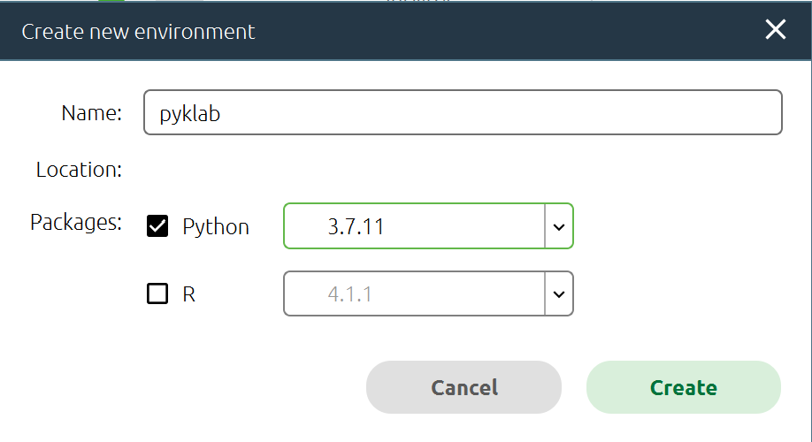

# How to set up jupyterlab
### 1. Download the Graphical Installer from <a href="https://www.anaconda.com/products/individual">Anaconda's official website</a>. Follow the Installer's instructions to complete the installation.

  

### 2. Start Anaconda-Navigator

  

### 3. Switch to the Environments tab and press the "Create" button at the bottom of the page.

  

### 4. Input an arbitrary name for the virtual environment, select the Python version, and click the "Create" button to create the virtual environment.

  

### 5. Go back to the Home tab and click on the button in the JupyterLab card to "Install" and "Launch".

  

### 6.You can use jupyterlab. Please work in your working space where the downloaded pyklab library exists.

  